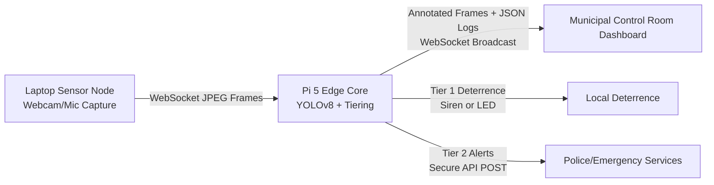

# Execution Guide

This guide runs the AI-Powered Street Safety Device Network proof-of-concept across the laptop sensor node, the Raspberry Pi 5 edge core, and the municipal control room dashboard.

## Architecture Overview


## Environment Setup (Laptop)

### Python Sensor Node
```powershell
cd "i:\My Drive\SIP\Prototype"
python -m venv .venv
.\.venv\Scripts\Activate.ps1
pip install -r laptop\requirements.txt
```
These commands create an isolated Python environment and install the capture/stream dependencies from requirements.txt, keeping the Windows system Python clean.

### Next.js Dashboard
```powershell
cd "i:\My Drive\SIP\Prototype\dashboard"
npm install
Copy-Item .env.example .env.local
```
`npm install` pulls the dashboard dependencies defined in package.json. The env copy step prepares a local configuration file; edit it to point to the Pi WebSocket IP before running the dashboard.

## Environment Setup (Pi 5)

### OS Prerequisites
```bash
sudo apt update
sudo apt install -y python3-venv python3-pip libopenblas-dev libatlas-base-dev libgl1
```
These packages provide Python tooling and native math/graphics libraries needed by OpenCV and YOLOv8.

### Python Environment and Dependencies
```bash
mkdir -p ~/edge-ai
# Copy the /pi folder from the laptop project into ~/edge-ai
cd ~/edge-ai/pi
python3 -m venv .venv
source .venv/bin/activate
pip install --upgrade pip
pip install -r requirements.txt
```
The venv keeps Pi dependencies isolated, and requirements.txt installs OpenCV, Ultralytics YOLOv8, WebSockets, and alert dispatch tools.

### Threat Policy Configuration
Review and adjust tiers in config.json. Tier 1 triggers local deterrence, Tier 2 triggers immediate alert escalation. If you need alert forwarding, set `ALERT_WEBHOOK_URL` in a local env file or export it before running the server.

## Boot Sequence

1. **Start the Pi edge server**
   ```bash
   cd ~/edge-ai/pi
   source .venv/bin/activate
   python3 edge_server.py --config config.json
   ```
   This starts the ingest WebSocket and dashboard broadcast service, plus YOLOv8 inference.

2. **Start the laptop sensor stream**
   ```powershell
   cd "i:\My Drive\SIP\Prototype"
   .\.venv\Scripts\Activate.ps1
   python laptop\stream_client.py --pi-host <PI_IP_ADDRESS>
   ```
   This begins webcam capture and streams frames to the Pi ingest endpoint.

3. **Launch the dashboard**
   ```powershell
   cd "i:\My Drive\SIP\Prototype\dashboard"
   npm run dev
   ```
   Open http://localhost:3000 to view the municipal control room UI.