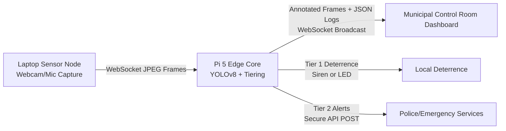

# AI-Powered Street Safety Device Network

This repository contains the prototype implementation of the **AI-Powered Street Safety Device Network** (ASIP ASIP_127 / 24UTAI13), developed for Atria Institute of Technology, Bengaluru.

The network integrates a Laptop (acting as a visual sensor node & browser dashboard) with a Raspberry Pi 5 (acting as the Edge Compute Core running YOLOv8 detection and threat tiering).

---

## 📐 Architecture Overview



---

## 🛠️ Integration Walkthrough

We have successfully migrated the prototype code back to the **`main` branch** (following the recovery of the Raspberry Pi 5 hardware) and established active communication between the laptop and the Pi edge core.

### 1. Network & Connection Discovery
- **Active Subnet:** The laptop and Raspberry Pi are connected to the same Wi-Fi network under the `10.253.13.x` subnet.
- **Pi Hostname:** `raspberrypi.local`
- **Pi IP Address:** `10.253.13.25`
- **Credentials Configured:** Located in the gitignored [.env](.env) file:
  - `IP_ADDRESS=<Raspberry_Pi_IP>` (e.g. `10.253.13.25`)
  - `USERNAME=<Pi_Username>`
  - `PASSWORD=<Pi_Password>`

To locate the Raspberry Pi and establish the connection, we executed the following steps and commands:
1. **Network Discovery:** Checked the local interface IP/subnet on the Laptop using:
   ```powershell
   ipconfig
   ```
2. **mDNS Resolution:** Pinged the Pi's hostname forcing IPv4 to discover and resolve its dynamic IP address on the current subnet:
   ```powershell
   ping -4 -n 1 raspberrypi.local
   ```
   *This resolved the Pi's active IP to `10.253.13.25`.*
3. **SSH Connection:** Logged into the Pi using standard SSH (substituting credentials from `.env`):
   ```bash
   ssh <USERNAME>@<IP_ADDRESS>
   ```

### 2. Configuration Adjustments
- Updated the root [.env](.env) file to reference the Pi's dynamic IP (`10.253.13.25`).
- Configured the Next.js control room dashboard in [dashboard/.env.local](dashboard/.env.local) to point to the Pi edge server:
  ```env
  NEXT_PUBLIC_PI_WS_URL=ws://10.253.13.25:8766
  ```

### 3. Verification & Inference Tests
- **Environment Diagnostics:** Verified that the Pi's Python virtual environment has all necessary ML and web stack packages (`ultralytics` YOLOv8, `cv2`, `websockets`, `numpy`).
- **Telemetry Verification:** Successfully launched the edge server on the Pi and streamed webcam frames from the laptop. The Pi console logs confirmed frame decoding and YOLOv8 threat classification working in real-time, correctly identifying a `person` (user) and outputting simulated deterrence logs.

---

## 🚀 Execution Guide

Follow these steps to get all services up and running.

### Step 1: Start the Raspberry Pi Edge Server

> [!IMPORTANT]
> Do NOT run the `nohup` or `tail` commands directly in your Laptop's Windows PowerShell terminal. They are Linux commands and must be run inside the Raspberry Pi SSH terminal session.

1. **Connect to the Raspberry Pi over SSH:**
   Open a PowerShell window on your **Laptop** and run:
   ```powershell
   ssh $USERNAME$@$IP_ADDRESS$
   ```
   *(Enter $password$ when prompted)*

2. **Run the edge server (inside the Raspberry Pi SSH terminal session):**
   ```bash
   # Start the server in the background
   nohup ~/edge-ai/pi/.venv/bin/python3 ~/edge-ai/pi/edge_server.py --config ~/edge-ai/pi/config.json --model ~/edge-ai/pi/yolov8n.pt > ~/edge-ai/pi/server.log 2>&1 &

   # Monitor logs
   tail -f ~/edge-ai/pi/server.log
   ```
The server will start listening on port `8765` for image ingestion and port `8766` for dashboard broadcasting.

### Step 2: Start the Next.js Dashboard
In a PowerShell window on your **Laptop**:
```powershell
cd c:\SIP-Prototype\Prototype\dashboard
npm run dev
```
Open **[http://localhost:3000](http://localhost:3000)** in Chrome/Firefox. Grant mic permissions when prompted to enable local audio visualization.

### Step 3: Start the Laptop Camera Stream Client
In a separate PowerShell window on your **Laptop**:
```powershell
cd c:\SIP-Prototype\Prototype
.\.venv\Scripts\python.exe laptop\stream_client.py --pi-host 10.253.13.25
```
This begins capturing frames from your laptop's camera and streaming them to the Pi edge server. The Pi log will output `INFO Deterrence simulated for person`.

---

## 🛑 Stopping/Ending the System

To cleanly terminate all running background processes:

### 1. Stop the Laptop Stream Client
- In the active PowerShell terminal running `stream_client.py`, press `Ctrl + C`.
- Or run this command from a new PowerShell prompt:
  ```powershell
  Get-CimInstance Win32_Process -Filter "CommandLine LIKE '%stream_client%'" | ForEach-Object { Stop-Process -Id $_.ProcessId -Force }
  ```

### 2. Stop the Dashboard Server
- In the active PowerShell terminal running `npm run dev`, press `Ctrl + C`.
- Or release port `3000` via PowerShell:
  ```powershell
  Stop-Process -Id (Get-NetTCPConnection -LocalPort 3000).OwningProcess -Force
  ```

### 3. Stop the Raspberry Pi Edge Server
On the **Raspberry Pi 5** (via SSH):
```bash
pkill -f edge_server.py
```
To verify it terminated successfully, run `ps aux | grep edge_server.py` (which should return no processes).